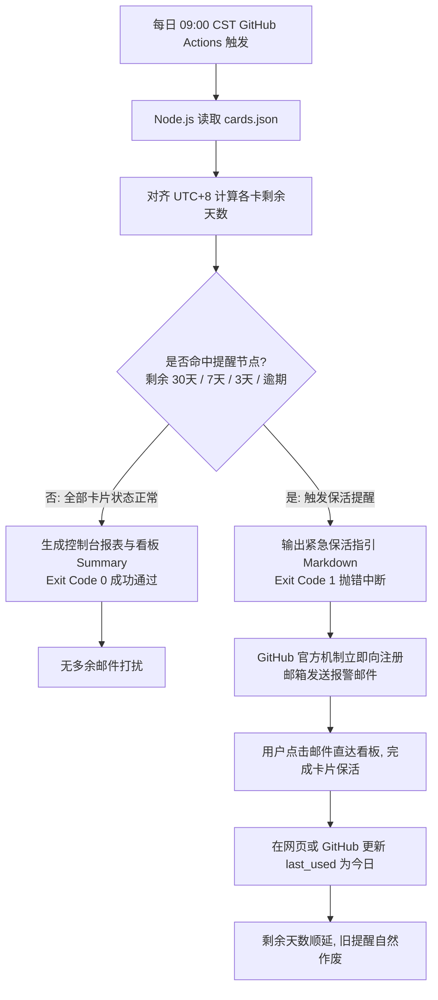

# Keepalive Reminder

> 🔗 **在线交互看板 (About)**: [**https://yang-xianfeng.github.io/keepalive-reminder/**](https://yang-xianfeng.github.io/keepalive-reminder/)

[](https://yang-xianfeng.github.io/keepalive-reminder/)
[](https://github.com/yang-xianfeng/keepalive-reminder/actions)
[](checker.js)

针对多持有多币种借记卡、境外电话卡或长周期海外数字资产的个人开发者，设计的一套**免服务器、零维护成本、原生抗干扰**的保活倒计时监控与自动化邮件预警系统。

---

## 为什么会有这个项目？

持有境外资产（如香港银行账户、海外实体卡与 eSIM）的人群往往面临一个共同的痛点：**保活规则繁杂、周期跨度长、极易遗忘**。

一旦错过保活节点：
* 境外银行账户会被系统列入沉睡不动户（Dormant Account），不仅网银转出功能受限，甚至需要亲自飞往境外分行柜面重新提交常住地址、税务居民证明以恢复账户；
* 境外电话卡一旦超出活跃保护期，IMSI 将在核心网被永久注销，绑定的境外各类重要服务将彻底失效。

市面上常见的提醒方案（自建云服务器运行 Cron、维护 Telegram 机器人或企业微信 Webhook），往往引入了过多的外部依赖和网络不稳定因素（如 Token 失效、反代被墙、npm 依赖构建中断等）。

**本项目追求“如无必要，勿增实体”的工程克制**：
1. **纯静态交互看板**：单文件原生响应式网页，行式展现卡片生命周期进度，手机/电脑随开随用；
2. **零外部配置的邮件告警**：利用 GitHub Actions 的构建失败邮件机制（平时成功不打扰，到期退出码报错触发官方高优先级邮件），无需配置任何 SMTP 授权码或 Bot Token；
3. **极简单一事实源**：以 `cards.json` 为核心，只要更新一次激活日期，后续所有提醒自然重置顺延；
4. **原生 0 依赖保障**：纯原生 Node.js（标准库 `fs`/`path`），执行全程仅耗时 2 秒，彻底杜绝 CI 构建故障；
5. **AI 协作成熟规范**：附带专属 [`AGENTS.md`](AGENTS.md)，任何 AI 助手都能遵循规范为你打理日常新增与更新。

---

## 资产状态全景与专业风控背景

当前纳入监控的核心资产如下：

```text
┌────────────────────────────┬──────────┬──────────────┬──────────────┬──────────┬──────────────┐
│ 资产名称                   │ 类别     │ 上次活跃日期 │ 下次截止日期 │ 剩余天数 │ 当前状态     │
├────────────────────────────┼──────────┼──────────────┼──────────────┼──────────┼──────────────┤
│ 汇丰香港蓝狮子扣账卡       │ 银行借记 │ 2026-05-29   │ 2026-11-25   │ 81 天    │ 🟢 剩余 81 天│
│ esim.gg 全球漫游电话卡     │ 境外eSIM │ 2026-09-05   │ 2027-09-05   │ 365 天   │ 🟢 剩余 365天│
└────────────────────────────┴──────────┴──────────────┴──────────────┴──────────┴──────────────┘
```

### 1. 汇丰香港蓝狮子扣账卡（Mastercard Debit Card）
* **保活周期**：建议 **180 天（半年）** 一次（官方设定为连续 12 个月无交易标记为不动户）。
* **风控底层逻辑**：
  香港金管局（HKMA）反洗钱及打击恐怖主义融资指引对银行离岸综合账户有严格的动态画像监控。尽管官方冻结门槛为 12 个月，但长期零资金流动的账户极易触发银行的反洗钱算法预警或合规尽职调查（KYC）信件。
* **推荐实操动作**：
  * **日常消费（推荐）**：蓝狮子卡绑定微信支付或支付宝快捷支付，在内地任意消费一笔（不限金额，几元即可）；
  * **网银操作**：登录 HSBC HK App 执行一次小额货币兑换（如 10 港币兑换为美元），或通过转数快（FPS）进行一笔资金互转。

### 2. esim.gg 全球漫游电话卡
* **保活周期**：**365 天（一年）**。
* **核心网计费逻辑**：
  该卡的计费系统（OCS）按年轮询活跃记录。境外数据漫游核心依靠漫游卡在访问地网络（如国内接入中国移动/联通）发起的位置更新（Location Update）信令鉴权。
* **推荐实操动作**：
  * 打开手机蜂窝设置，开启该 eSIM 线路并允许数据漫游；
  * 成功接入国内基站联网（状态栏显示中国移动/联通漫游信号），产生信令握手即视为一次有效激活，有效期自动顺延 360-365 天；
  * **注意**：建议账户保持 ≥ 5 欧元余额，以避免因系统扣费失败导致保号机制中断。

---

## 架构与工作流实现



---

## 交互使用指南

### 1. 访问与使用在线看板
打开 [**https://yang-xianfeng.github.io/keepalive-reminder/**](https://yang-xianfeng.github.io/keepalive-reminder/)：
* **查看进度**：行式列表清晰展示各卡片当前已消耗天数比例与剩余天数进度条；
* **一键打卡**：当你完成保活操作后，点击卡片下方的 **“✅ 标记今天已保活”**，系统自动更新本地预览，并提供跳转按钮，点一下直接在 GitHub 网页保存更新；
* **添加资产**：点击右上角 **“➕ 新增资产”**，一键复制格式化模板快速追加新项目。

### 2. 启用 GitHub Pages（若初次使用）
1. 打开 GitHub 仓库设置：**Settings** -> **Pages**；
2. **Build and deployment** 选择 `Deploy from a branch`；
3. **Branch** 选择 `main`，目录保留 `/ (root)`，点击 **Save**；
4. 约 1 分钟后你的看板即可全球畅通访问。

### 3. 本地环境验证
```bash
# 巡检测试（无论是否有告警均以 exit 0 退出，展示格式化表格）
node checker.js --test

# 真实触发逻辑（命中预警将返回 exit 1）
node checker.js
```

---

## 交给 AI 协作者维护

本仓库深度适配 AI 结对开发。若需调整配置或增加新卡，可直接在 AI 聊天框中发起：
* *“我今天把汇丰蓝狮子卡刷了一笔，帮我更新一下记录”*
* *“帮我新增一张英国 Giffgaff SIM 卡，查一下最新的 180 天保活规则”*

AI 将自动根据根目录的 [`AGENTS.md`](AGENTS.md) 规则，自动遵循 0 依赖约束完成本地验证、文档同步并提交代码。
